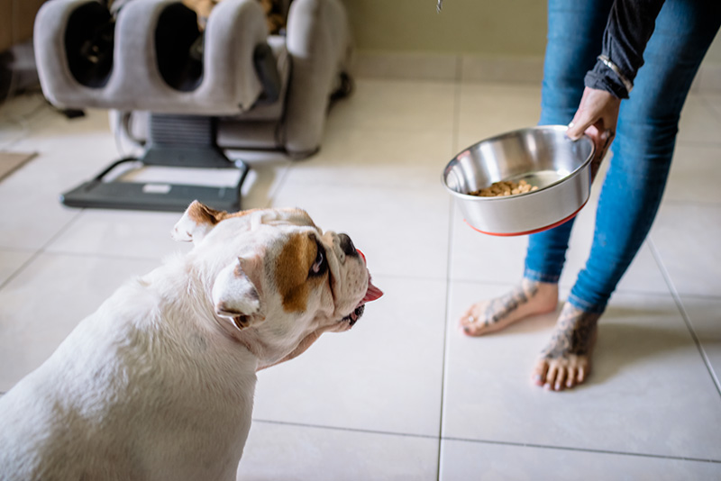
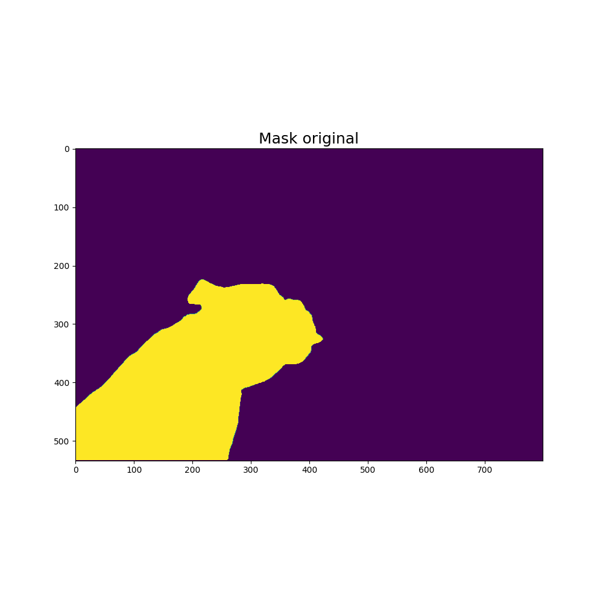

# Segment Anything TensorRT 
Introduction
------------
Welcome to the TensorRT implementation of the "Segment Anything" model!

Overview:
------------
This repository contains the implementation of the "Segment Anything" model in TensorRT. While I found existing implementations for vit_b and vit_l, I couldn't find one for vit_h. Therefore, to the best of my knowledge, this is the first implementation available online that covers all three model types.

Features:
-----------
- Model Export: Convert PyTorch models to TensorRT engines for enhanced performance.
- Inference: Perform image inference using the exported TensorRT models.
- Benchmarking: Measure the performance of TensorRT models.
- Accuracy Evaluation: Assess the accuracy of models using test images.
- SAM Modification: contains the modified predictor that can accept embeddings from the TensorRT engine, and a modified SAM model for vit_h conversion in the sam_modification folder.

I'm open to contributions and feedback. If you'd like to contribute or provide feedback, feel free to open an issue or submit a pull request!

Requirements
-------------
This repository comes with a Docker file for easy setup. However, there are some additional requirements:
- The Docker image automatically installs Onnx opset version 17 or above. If there is a version mismatch preventing the Docker from loading, please consider upgrading your Nvidia drivers on your computer if necessary. Please note that lowering the Docker version might cause opset 17 to be unavailable.

Model Conversion
----------------
The models vit_b and vit_l are exported normally without any complications.
However, the vit_h model presents a challenge due to its size, weighing 2.6GB, which exceeds the protobuf limit of 2GB.
To overcome this limitation, the model had to be split into two separate parts,
resulting in the generation of two distinct models which can later be ensemble.
This approach allows for the successful conversion while staying within the protobuf size constraint.

How to run
-------------
1. Clone the repository:
``` git clone https://github.com/ItayElam/SegmentAnything-TensorRT.git ```
2. download one of the checkpoints from segment-anything repository on GitHub or anywhere else and place it inside the cloned repository. for example, inside pth_model
3. Navigate to the cloned repository and run the launch script:
```bash 
cd SegmentAnything-TensorRT 
chmod +x launch.sh 
./launch.sh -b # build the image
./launch.sh -r # run the image
````
 - run the main.py script. for more details about the launch commands refer to [Example Launch Commands](#example-launch-commands)


------------------------------------------------------
## Performance

### Benchmarking on RTX 3090

#### Performance Comparison for vit_b
| Model              | Average FPS | Average Time (sec) | Relative FPS | Relative Time (%) |
|------------------- |-------------|--------------------|--------------|-------------------|
| PyTorch model      | 9.96        | 0.100417           | 1.0          | 100.0             |
| TensorRT model     | 15.24       | 0.065603           | 1.53         | 65.33             |
| TensorRT FP16 model| 29.32       | 0.034104           | 2.94         | 33.96             |
------------------------------------------------------

#### Performance Comparison for vit_l
| Model              | Average FPS | Average Time (sec) | Relative FPS | Relative Time (%) |
|------------------- |-------------|--------------------|--------------|-------------------|
| PyTorch model      | 3.91        | 0.255552           | 1.0          | 100.0             |
| TensorRT model     | 4.81        | 0.208019           | 1.23         | 81.4              |
| TensorRT FP16 model| 11.09       | 0.090139           | 2.84         | 35.27             |
------------------------------------------------------

#### Performance Comparison for vit_h
| Model              | Average FPS | Average Time (sec) | Relative FPS | Relative Time (%) |
|------------------- |-------------|--------------------|--------------|-------------------|
| PyTorch model      | 2.22        | 0.45045            | 1.0          | 100.0             |
| TensorRT model     | 2.37        | 0.421377           | 1.07         | 93.55             |
| TensorRT FP16 model| 5.97        | 0.167488           | 2.69         | 37.18             |
------------------------------------------------------

## Accuracy

* Accuracy was measured using 100 random images with the input point being randomly selected each time.

------------------------------------------------------

#### IOU Comparison for vit_b

| Model      | Minimum IOU | Mean IOU |
|------------|-------------|----------|
| vit_b FP32 | 0.9986      | 0.9997   |
| vit_b FP16 | 0.9931      | 0.9986   |
------------------------------------------------------

#### IOU Comparison for vit_l               

| Model      | Minimum IOU | Mean IOU |
|------------|-------------|----------|
| vit_l FP32 | 0.9983      | 0.9996   |
| vit_l FP16 | 0.9958      | 0.9987   |
------------------------------------------------------

#### IOU Comparison for vit_h

| Model      | Minimum IOU | Mean IOU |
|------------|-------------|----------|
| vit_h FP32 | 0.9982      | 0.9997   |
| vit_h FP16 | 0.9911      | 0.9983   |
------------------------------------------------------

## Visualizations
### Original image
<p float="left">
  
</p>

### vit_b

<p float="left">
  
   
  
</p>

### vit_l

<p float="left">
  
   
  
</p>

### vit_h

<p float="left">
  
   
  
</p>

## Example Launch Commands

### Export Models
```bash
python main.py export --model_path pth_model/sam_vit_b_01ec64.pth --model_precision fp32
python main.py export --model_path pth_model/sam_vit_b_01ec64.pth --model_precision fp16
python main.py export --model_path pth_model/sam_vit_b_01ec64.pth --model_precision both

# Repeat the above commands for vit_l and vit_h models
```
### Benchmarking
```bash
python main.py benchmark --sam_checkpoint pth_model/sam_vit_b_01ec64.pth --model_type vit_b --warmup_iters 5 --measure_iters 50
# Repeat the above command for vit_l and vit_h models
# --warmup_iters and --measure_iters are optional and default to 5 and 50 respectively
```
### Accuracy Evaluation
```bash
python main.py accuracy --image_dir test_images --model_type vit_b --sam_checkpoint pth_model/sam_vit_b_01ec64.pth
# Repeat the above command for vit_l and vit_h models
```
### Inference
when running inference, the image you provided will open up for you to choose the point.
after you're satisfied with the location, press enters to run inference.
```bash
# vit_b and vit_l
python main.py infer --pth_path pth_model/sam_vit_b_01ec64.pth --model_1 exported_models/vit_b/model_fp32.engine --img_path images/original_image.jpg
# vit_h
python main.py infer --pth_path pth_model/sam_vit_h_4b8939.pth --model_1 exported_models/vit_h/model_fp32_1.engine --model_2 exported_models/vit_h/model_fp32_2.engine --img_path images/original_image.jpg
```


Feel free to modify the command arguments according to your setup and requirements. For additional usage scenarios, you can refer to tests.py.


Should you have any questions or wish to contribute, please feel free to open an issue or create a pull request. 